# 1.环境(不限制与此处给出配置)

    系统 win 10
    IDE VS2013
    构建工具 Cmake 3.15.1
    编译器 MinGw

## 1.1 Cmake

安装教程(略)  
官网下载地址：https://cmake.org/download/  
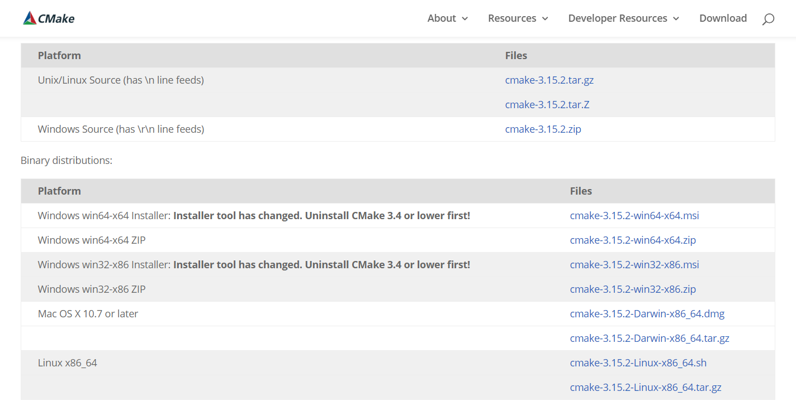

## 1.2 MinGW(不使用 MinGW 编译可忽略 MinGW 部分）

安装教程(略)  
官网下载地址：https://osdn.net/projects/mingw/releases/  
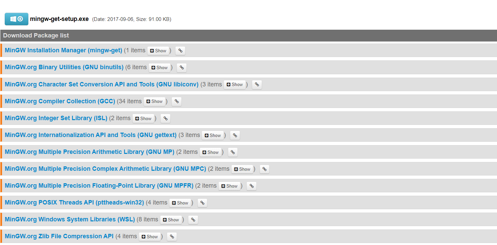

# 2.下载 CGNS 源码

github 地址：https://github.com/CGNS/CGNS (直接点击 DownloadZIP 下载， Git 工具可能较慢)  
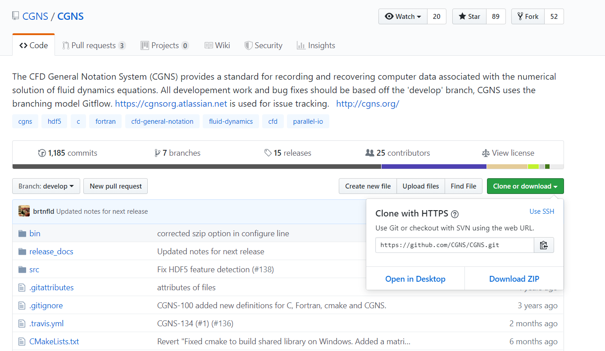

# 3.configure 配置

## 3.1 解压源码到指定的文件夹下

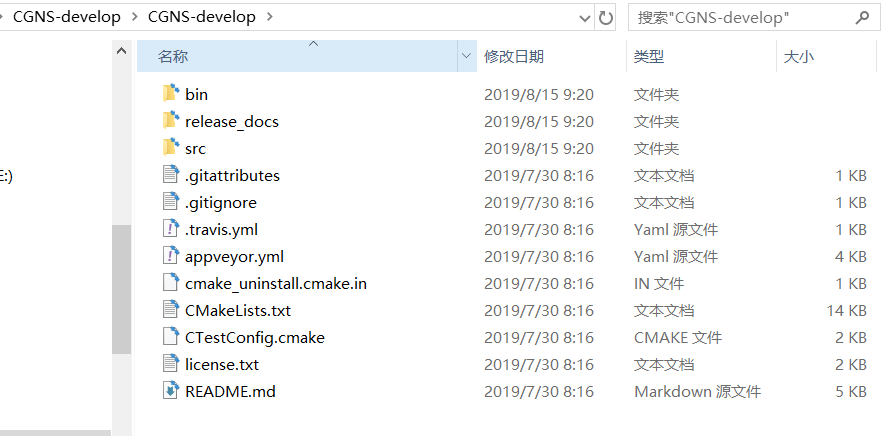

## 3.2 打开 Cmake 选择包含 CMakeLists.txt 的目录

选择源码文件
(此处源码解压在桌面，故选择桌面的 CGNS-develop, 注意默认解压的文件有两个 CGNS-develop，进入最里层的 CGNS-develop)  
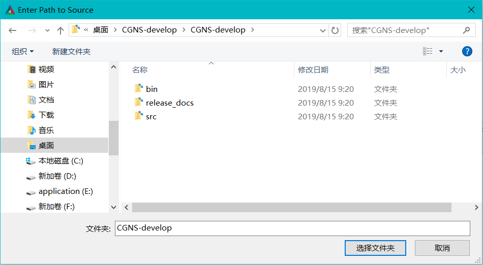  
选择生成到的目标文件夹
(此处选择在桌面创建的一个空文件夹 target)  
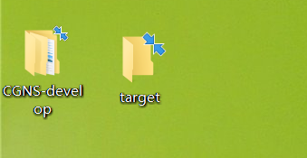

## 3.3 configure 配置

在 Cmake 的界面我们勾选 Grouped 与 Advanced(选择后会帮我们把配置的变量分组)  
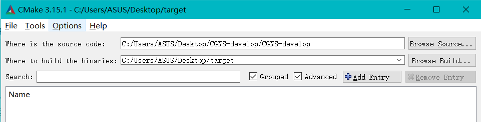  
点击 configure，选择要构建的环境，此处我们选择要使用的 VS2013，目标 x64 平台，Finnish  
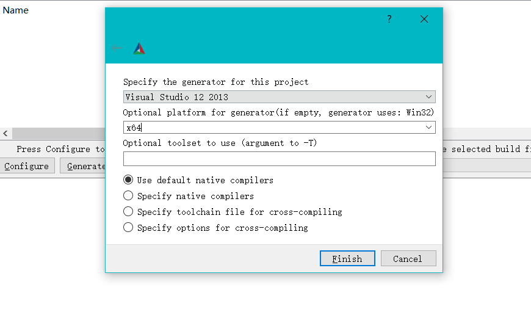  
若中途无报错，生成效果如下：  
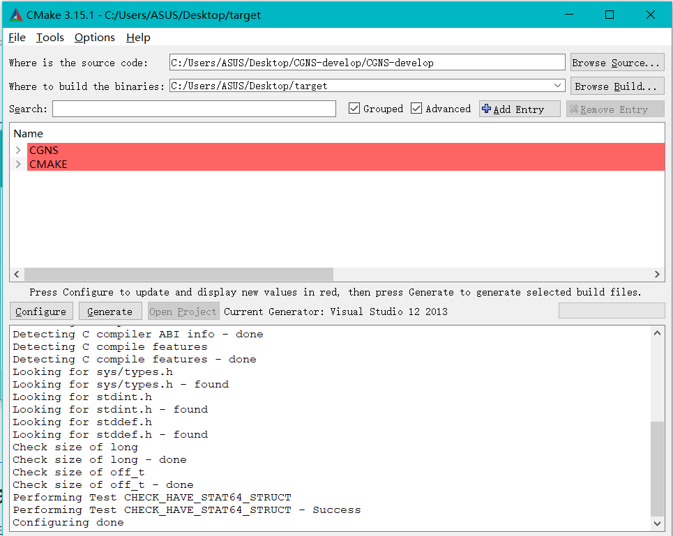  
配置属性变量：(根据需求进行配置)
属性具体详情查看 github 的 readme 文档：https://github.com/CGNS/CGNS/tree/develop/src  
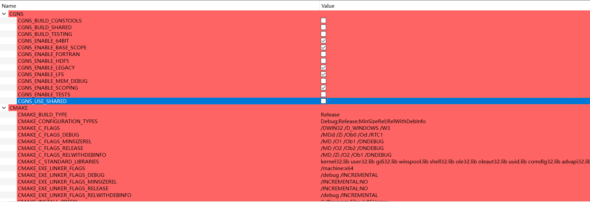

# 4.generate 生成 VS sln 解决方案

点击 generate 生成 sln 解决方案  
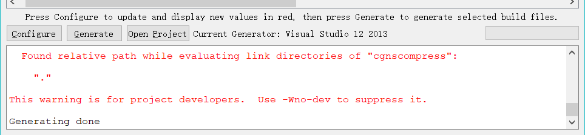  
查看目标文件夹，可以发现解决方案等文件已经创建好：  
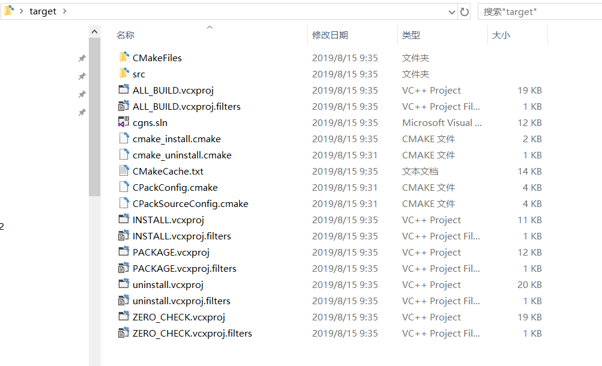

# 5.使用 Visual Studio 生成库文件

使用 VS2013 打开 cgns.sln:  
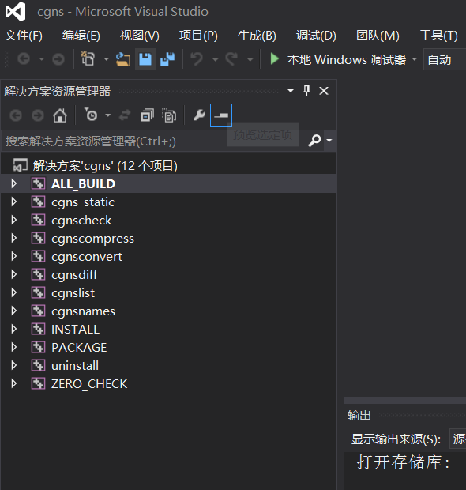  
具体设置可自行配置属性
选择生成 --> 生成解决方案：  
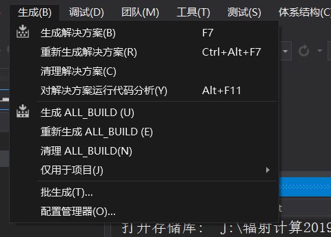  
此处我们会得到编译报错：  
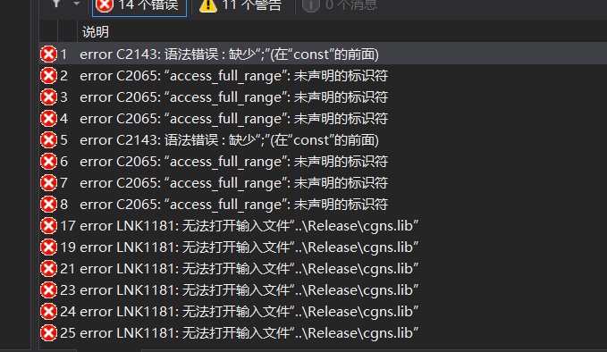  
我们更具报错找到位置(双击红色标记的行)：  
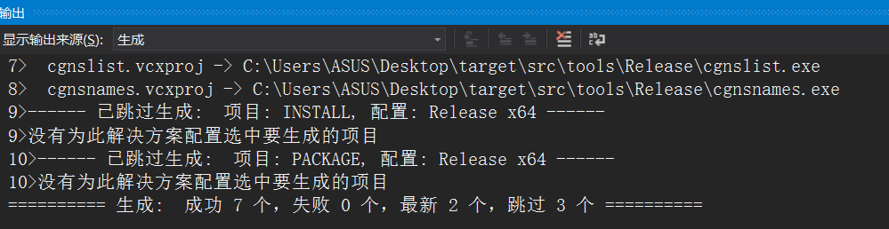  
我们将每个此类型的错误都进行如下更改：
将变量先定义到此处作用域的前面几行，在赋值  
注意，常量符号 const 要去除，常量只能初始化就赋值；
其他更改同上，可以更改一处后继续编译，如遇报错，每次选择第一个错误，大概更改 3 处左右编译成功。  
查看 target 文件夹下：  
  
库文件生成成功。  
配套的头文件在源码文件夹下：  
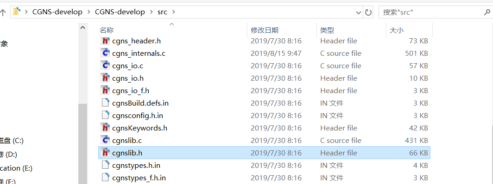
