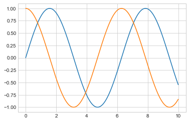

# 绘图 （线性）


```python
import matplotlib.pyplot as plt
import numpy as np

x = np.linspace(0, 10, 100)
# print(x)
fig = plt.figure()
plt.plot(x, np.sin(x), '*')
plt.plot(x, np.cos(x), '-.')
fig.savefig('res1.png')
```


# 保存图片


```python
import matplotlib.pyplot as plt
import numpy as np

x = np.linspace(0, 10, 100)
# print(x)
plt.plot(x, np.sin(x), '*')
plt.plot(x, np.cos(x), '.')
plt.show()
```


# 画子图(matplab风格)


```python
import matplotlib.pyplot as plt
import numpy as np

x = np.linspace(0, 10, 100) 
plt.figure()

# 子图一
plt.subplot(2, 2, 1)
plt.plot(x, np.sin(x))
# 子图二
plt.subplot(2, 2, 2)
plt.plot(x, np.cos(x))
# 子图三
plt.subplot(2, 2, 3)
plt.plot(x, np.tan(x))
# 子图四
plt.subplot(2, 2, 4)
plt.plot(x, np.arctan(x))
```


    [<matplotlib.lines.Line2D at 0x219404897f0>]


# 画子图(面向对象风格)


```python
import matplotlib.pyplot as plt
import numpy as np

x = np.linspace(0, 10, 100)
fig, ax = plt.subplots(2)
ax[0].plot(x, np.sin(x))
ax[1].plot(x, np.cos(x))

```


    [<matplotlib.lines.Line2D at 0x2194058ddd8>]


# 线性网格图


```python
import matplotlib.pyplot as plt
import numpy as np

x = np.linspace(0, 10, 1000)
plt.style.use('seaborn-whitegrid')
fig = plt.figure()
ax = plt.axes()
ax.plot(x, np.sin(x))
ax.plot(x, np.cos(x))
```


    [<matplotlib.lines.Line2D at 0x2194181bba8>]





# 设置颜色、线条


```python
'''
    设置线条颜色
'''
import matplotlib.pyplot as plt
import numpy as np

x = np.linspace(0, 10, 100)
fig, ax = plt.subplots(2,1)
ax[0].plot(x, np.sin(x - 0))#, color='blue'
ax[0].plot(x, np.sin(x - 1))#, color='orange'
ax[0].plot(x, np.sin(x - 2))#, color='red'
ax[0].plot(x, np.sin(x - 3))#, color='green'

ax[1].plot(x, np.sin(x - 0), color='blue')
ax[1].plot(x, np.sin(x - 1), color='orange')
ax[1].plot(x, np.sin(x - 2), color='red')
ax[1].plot(x, np.sin(x - 3), color='green')
```


    [<matplotlib.lines.Line2D at 0x21941b77320>]


```python
'''
    设置形状、颜色
'''
import matplotlib.pyplot as plt
import numpy as np

x = np.linspace(0, 10, 100)
plt.plot(x, np.sin(x - 0), linestyle='-',color='blue')
plt.plot(x, np.sin(x - 1), linestyle='--',color='orange')
plt.plot(x, np.sin(x - 2), linestyle='-.',color='red')
plt.plot(x, np.sin(x - 3), linestyle=':',color='green')
```


    [<matplotlib.lines.Line2D at 0x21941bf2828>]


```python
'''
    综合设置形状、颜色
'''
import matplotlib.pyplot as plt
import numpy as np

x = np.linspace(0, 10, 100)
plt.plot(x, np.sin(x - 0),'-g')
plt.plot(x, np.sin(x - 1),'--c')
plt.plot(x, np.sin(x - 2),'-.k')
plt.plot(x, np.sin(x - 3), ':r')
```


    [<matplotlib.lines.Line2D at 0x21941c5b390>]


# 设置坐标轴


```python
"""
    逆序
"""
import matplotlib.pyplot as plt
import numpy as np

x = np.linspace(0, 10, 100)
plt.plot(x, np.sin(x))
plt.xlim(11, -1)
plt.ylim(1.5, -1.5)

```


    (1.5, -1.5)


```python
import matplotlib.pyplot as plt
import numpy as np

x = np.linspace(0, 10, 100)
plt.plot(x, np.sin(x))
plt.xlim(-1, 11)
plt.ylim(-1.5, 1.5)

```


    (-1.5, 1.5)


# 设置标签


```python
import matplotlib.pyplot as plt
import numpy as np

x = np.linspace(0, 10, 100)
plt.plot(x, np.sin(x))
plt.title("A Sine Curve")
plt.xlabel("x")
plt.ylabel("sin(x)")
```


    Text(0, 0.5, 'sin(x)')


```python
import matplotlib.pyplot as plt
import numpy as np

x = np.linspace(0, 10, 100)
plt.plot(x, np.sin(x), '-g', label='sin(x)')
plt.plot(x, np.cos(x), ':b', label='cos(x)')
# plt.axis('equal')

plt.legend()
```


    <matplotlib.legend.Legend at 0x21941e4b860>


