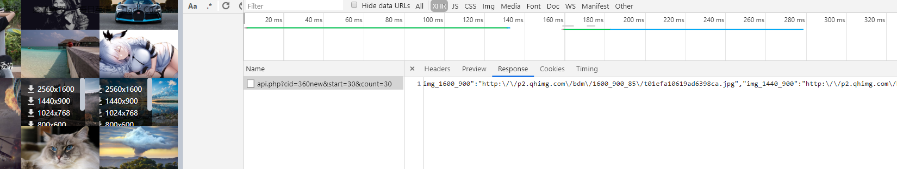
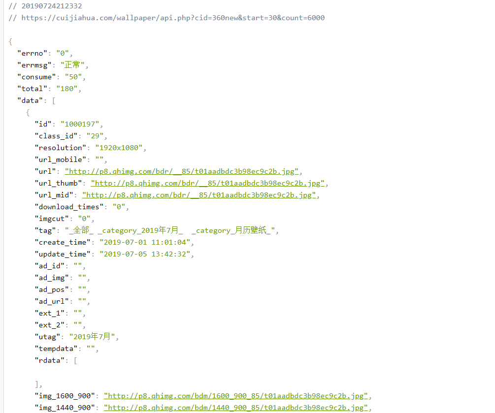
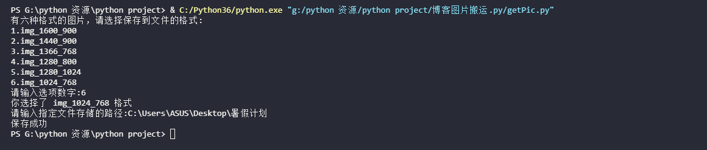
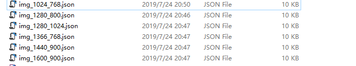

***
今天看到一个博客 它有一个图片展示页面  
然后。。。  
就手痒了，现在看到资源都想薅一波  
## 网页界面  
  
分析一下网页加载时的数据包  
由于是个人的博客网站  安全措施并没有那么严格 所以轻松抓到了图片数据的接口
  
返回的是一个json文件 包含了所有格式的图片数据  
  

写了一个程序 把数据保存下来 等后面自己博客的图片展示界面写好了 直接拿过来用 图片像素都挺高的  
***
## 执行  
  
## 效果  
  
