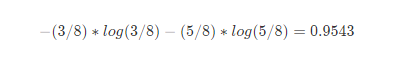

# 题目
***
:point_down:  

## 任务描述  
本关任务：根据本关所学知识，完成calcInfoEntropy函数，calcHDA函数以及calcInfoGain函数。  

## 相关知识
为了完成本关任务，你需要掌握：  
* 信息熵  
* 条件熵  
* 信息增益  
### 信息熵  
信息是个很抽象的概念。人们常常说信息很多，或者信息较少，但却很难说清楚信息到底有多少。比如一本五十万字的中文书到底有多少信息量。  

直到1948年，香农提出了“信息熵”的概念，才解决了对信息的量化度量问题。信息熵这个词是香农从热力学中借用过来的。热力学中的热熵是表示分子状态混乱程度的物理量。香农用信息熵的概念来描述信源的不确定度。信源的不确定性越大，信息熵也越大。  

从机器学习的角度来看，信息熵表示的是信息量的期望值。如果数据集中的数据需要被分成多个类别，则信息量I(xi)的定义如下(其中xi表示多个类别中的第i个类别，p(xi)数据集中类别为xi的数据在数据集中出现的概率表示)：  
  
由于信息熵是信息量的期望值，所以信息熵H(X)的定义如下(其中n为数据集中类别的数量)：  
  
从这个公式也可以看出，如果概率是0或者是1的时候，熵就是0。（因为这种情况下随机变量的不确定性是最低的），那如果概率是0.5也就是五五开的时候，此时熵达到最大，也就是1。（就像扔硬币，你永远都猜不透你下次扔到的是正面还是反面，所以它的不确定性非常高）。所以呢，熵越大，不确定性就越高。  
### 条件熵  
在实际的场景中，我们可能需要研究数据集中某个特征等于某个值时的信息熵等于多少，这个时候就需要用到条件熵。条件熵H(Y|X)表示特征X为某个值的条件下，类别为Y的熵。条件熵的计算公式如下：  
  
当然条件熵的一个性质也熵的性质一样，概率越确定，条件熵就越小，概率越五五开，条件熵就越大。  
### 信息增益  
现在已经知道了什么是熵，什么是条件熵。接下来就可以看看什么是信息增益了。所谓的信息增益就是表示我已知条件X后能得到信息Y的不确定性的减少程度。  

就好比，我在玩读心术。你心里想一件东西，我来猜。我已开始什么都没问你，我要猜的话，肯定是瞎猜。这个时候我的熵就非常高。然后我接下来我会去试着问你是非题，当我问了是非题之后，我就能减小猜测你心中想到的东西的范围，这样其实就是减小了我的熵。那么我熵的减小程度就是我的信息增益。  

所以信息增益如果套上机器学习的话就是，如果把特征A对训练集D的信息增益记为g(D, A)的话，那么g(D, A)的计算公式就是：  
  

为了更好的解释熵，条件熵，信息增益的计算过程，下面通过示例来描述。假设我现在有这一个数据集，第一列是编号，第二列是性别，第三列是活跃度，第四列是客户是否流失的标签（0:表示未流失，1:表示流失）。  

|编号|性别|活跃度|是否流失|
|:----:|:----:|:----:|:----:|
|1|男|高|0|
|2|女|中|0|
|3|男|低|1|
|4|女|高|0|
|5|男|高|0|
||6|男|中|0|
|7|男|中|1|
|8|女|中|0|
|9|女|低|1|
|10|女|中|0|
|11|女|高|0|
|12|男|低|1|
|13|女|低|1|
|14|男|高|0|
|15|男|高|0|  

假如要算性别和活跃度这两个特征的信息增益的话，首先要先算总的熵和条件熵。总的熵其实非常好算，就是把标签作为随机变量X。上表中标签只有两种（0和1）因此随机变量X的取值只有0或者1。所以要计算熵就需要先分别计算标签为0的概率和标签为1的概率。从表中能看出标签为0的数据有10条，所以标签为0的概率等于2/3。标签为1的概率为1/3。所以熵为：  
  
接下来就是条件熵的计算，以性别为男的熵为例。表格中性别为男的数据有8条，这8条数据中有3条数据的标签为1，有5条数据的标签为0。所以根据条件熵的计算公式能够得出该条件熵为：  
  
根据上述的计算方法可知，总熵为：  
  
性别为男的熵为：  
  
性别为女的熵为：  
  
活跃度为低的熵为：  
  
活跃度为中的熵为：  
  
活跃度为高的熵为：  
  
现在有了总的熵和条件熵之后就能算出性别和活跃度这两个特征的信息增益了。  
性别的信息增益=总的熵-(8/15)性别为男的熵-(7/15)性别为女的熵=0.0064  
活跃度的信息增益=总的熵-(6/15)活跃度为高的熵-(5/15)活跃度为中的熵-(4/15)*活跃度为低的熵=0.6776  
那信息增益算出来之后有什么意义呢？回到读心术的问题，为了我能更加准确的猜出你心中所想，我肯定是问的问题越好就能猜得越准！换句话来说我肯定是要想出一个信息增益最大（减少不确定性程度最高）的问题来问你。其实ID3算法也是这么想的。ID3算法的思想是从训练集D中计算每个特征的信息增益，然后看哪个最大就选哪个作为当前结点。然后继续重复刚刚的步骤来构建决策树。  

## 编程要求  
    根据提示，在右侧编辑器补充代码，完成calcInfoEntropy函数实现计算信息熵、calcHDA函数实现计算条件熵、calcInfoGain函数实现计算信息增益。  
    calcInfoEntropy函数中的参数:  
    feature：数据集中的特征，类型为ndarray  
    label：数据集中的标签，类型为ndarray  
    calcHDA函数中的参数:  
    feature：数据集中的特征，类型为ndarray  
    label：数据集中的标签，类型为ndarray  
    index：需要使用的特征列索引，类型为int  
    value：index所表示的特征列中需要考察的特征值，类型为int  
    calcInfoGain函数中的参数:  
    feature：测试用例中字典里的feature  
    label：测试用例中字典里的label  
    index：测试用例中字典里的index，即feature部分特征列的索引  
## 测试说明  
平台会对你编写的代码进行测试，期望您的代码根据输入来输出正确的信息增益，以下为其中一个测试用例：  
测试输入：  
`{'feature':[[0, 1], [1, 0], [1, 2], [0, 0], [1, 1]], 'label':[0, 1, 0, 0, 1], 'index': 0} ` 

预期输出：  
`0.419973  `

提示：  
计算log可以使用NumPy中的log2函数  
