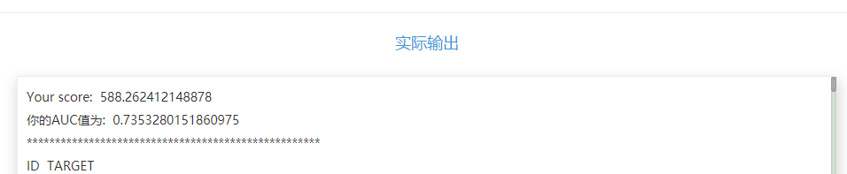
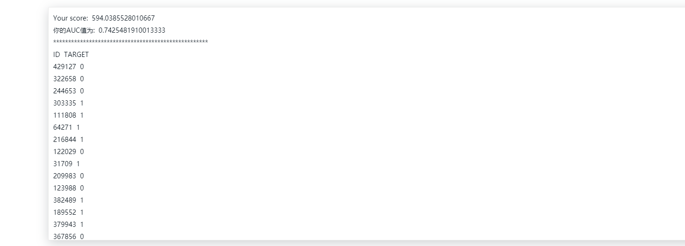

# 挑战任务
现在我们手上有用户购房的数据，需要你根据这些数据来预测客户对于产品的满意率。  

    测试、训练数据文件在input文件夹下
# 数据说明
为了完成本次挑战，你需要处理两种类型的数据，第一：训练集数据，第二：测试集数据，最后根据提供的两种数据生成预测结果文件，关于这三种数据|文件的说明如下：

## 训练集数据文件：
本关涉及到的训练集数据：train.csv：  
|ID|CoverageField2A|CoverageField4B|…|TARGET|
|:----:|:----:|:----:|:----:|:----:|
|6677|17|23|…|0|
|311485|2|1|…|0|
|414748|9|14|…|1|
|376916|4|3|…|0|
|261566|12|19|…|0|
|141602|10|16|…|1|
|306391|11|17|…|0|
|…|…|…|…|…|  

每行代表每个客户的基本画像属性，各字段由逗号分隔。第一列名ID，为标识变量；最后一列为TARGET，为目标变量；其余52列为匿名属性特征。其中，ID唯一标记每个客户及客户刻画属性特征，TARGET标记该客户对应的标签（0表示不愿意购买房屋保险，1表示愿意购买房屋保险）。

## 测试集数据文件：
本关涉及到的测试集数据文件 test.csv：

|ID|CoverageField2A|CoverageField4B|CoverageField11A|…|
|:----:|:----:|:----:|:----:|:----:|
|429127|11|17|17|…|
|322658|13|20|5|…|
|244653|3|2|7|…|
|303335|5|6|25|…|
|111808|6|7|-10|…|
|64271|1|1|-1|…|
|…|…|…|…|…|  

ID 唯一标记每个客户及客户属性特征，各字段由逗号分隔，格式与训练集完全相同，但其标签未给出，为预测变量。

## 预测结果文件
你需要根据上述测试集文件与训练集文件预测客户购买房屋保险的概率。

选手提交一个test_prediction.csv文件，编码采用无BOM的UTF-8, 格式如下，每行记录表示对某每个客户购买房屋保险概率预测
提交文件格式参考如下：

    ID, TARGET
    429127,0.8
    322658,0.4
    244653,0.5
    303335,0.1
    ……

点击测评，程序会比对你的预测结果与真实数据的差异，计算出AUC指标，该值越高则最终得分越高。

# 编程要求
请补全右侧编辑器中的getPrediction()函数，实现对每个客户满意率预测，并将预测结果文件生成在src/output/目录下，命名为test_prediction.csv。
参考思路：

* 读取src/step1/input/train.csv和 src/step1/input/test.csv文件；  
* 将训练集的客户匿名属性值和测试集属性值对比；  
* 生成预测结果文件；  
* 提交评测；  
* 持续优化以提高AUC指标。

注意：不提供机器学习库，请自主实现算法。  

你可以通过如下链接下载本关涉及到的数据文件：
[https://www.educoder.net/attachments/download/232858/input.zip](https://www.educoder.net/attachments/download/232858/input.zip)

最终你可以通过弹出的页面查看得分：
  
分数计算公式：

    auc <= 0.4
        score =  0
    auc <= 0.55
        score = auc³ * 800
    auc <= 0.7
        score = auc² * 800
    auc <= 1
        score = auc * 800
auc 的值在0 - 1 之间

---
    附提交结果:
---
  
---