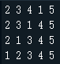

# 挑战任务
本关挑战任务是对一个数组进行排序，排序需要遵守一些规则：
* 先对数组从左到右，相邻元素进行比较，如果第一个比第二个大，就交换它们，进行一个升序排序；  
* 再对数组从右到左，相邻元素进行比较，如果第一个比第二个小，就交换它们，进行一个降序排序；  
* 以此类推，持续的、依次的改变排序的方向，并不断缩小没有排序的数组范围；  

按照这种规则依次给整个数组排序，并将排序过程打印到控制台。  
比如给出一组数据4，1，3，5，2排序过程如下：  

最后得到结果：1 2 3 4 5

## 编程要求
请在右侧编辑器中填充代码，补全sort(self,xlist)函数，实现指定的排序功能，并打印出排序过程，函数参数说明如下：

xlist：待排序的数组

注：不需排序的数组（如：1 2 3），直接打印原数组。

## 测试说明
### 样例1：
输入：
2 3 4 5 1  
输出：  
  
### 样例2：
输入：
1 5 4 3 2 6  
输出：  
  