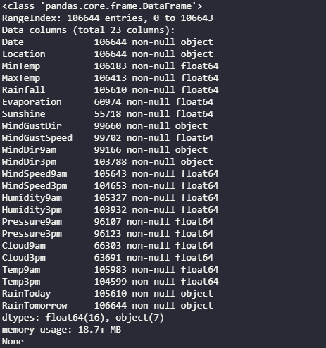
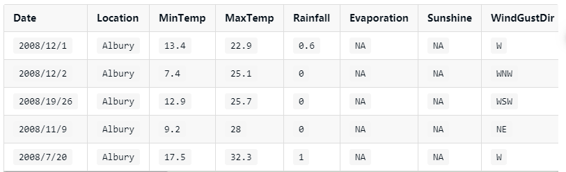
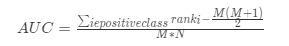
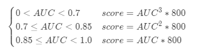
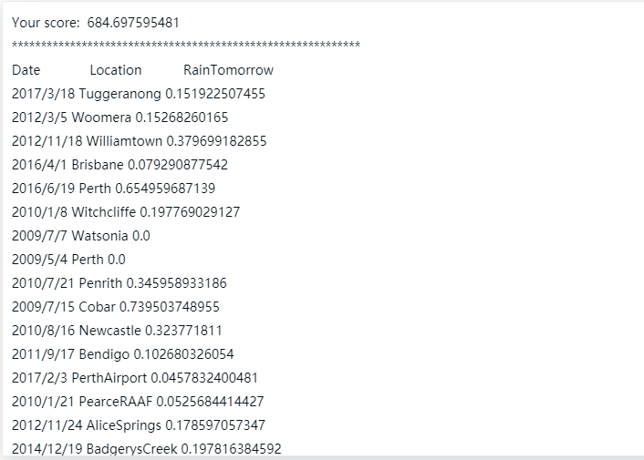

    第二届绿色计算的决赛最后一题 机器学习
    依旧是线性回归
    训练数据提供的依旧是数值与字符串的混合类型
    此次的数字化编码采用了独热编码将风向属性进行独热编码
    提供的训练数据含有大量的缺失：
    使用pandas 查看

代码:

    import pandas as pd

    df = pd.read_csv('input/train.csv')
    print(df.info())

结果：  

---

## 解题 ：梯度下降法 独热编码

# 挑战任务

现在有一些由气象站提供的每日降雨数据，我们需要根据历史降雨数据来预测明天会下雨的概率。

# 数据说明

为了完成本次挑战，你需要处理两种类型的数据，第一：训练集数据，第二：测试集数据，最后根据提供的两种数据生成预测结果文件，关于这三种数据文件的说明如下：

# 训练集数据文件

本关涉及到的训练集数据 train.csv 的部分数据如下：  
  
各个特征描述如下：

|   特征名称    |       意义        | 取值范围 |
| :-----------: | :---------------: | :------: |
|     Date      |       日期        |  字符串  |
|   Location    |   气象站的地址    |  字符串  |
|    MinTemp    |     最低温度      |   实数   |
|    MaxTemp    |     最高温度      |   实数   |
|   Rainfall    |      降雨量       |   实数   |
|  Evaporation  |      蒸发量       |   实数   |
|   Sunshine    |     光照时间      |   实数   |
|  WindGustDir  |  最强的风的方向   |  字符串  |
| WindGustSpeed |  最强的风的速度   |   实数   |
|  WindDir9am   |  早上 9 点的风向  |  字符串  |
|  WindDir3pm   |  下午 3 点的风向  |  字符串  |
| WindSpeed9am  |  早上 9 点的风速  |   实数   |
| WindSpeed3pm  |  下午 3 点的风速  |   实数   |
|  Humidity9am  |  早上 9 点的湿度  |   实数   |
|  Humidity3pm  |  下午 3 点的湿度  |   实数   |
|  Pressure9am  | 早上 9 点的大气压 |   实数   |
|  Pressure3pm  | 早上 3 点的大气压 |   实数   |
|   Cloud9am    | 早上 9 点的云指数 |   实数   |
|   Cloud3pm    | 早上 3 点的云指数 |   实数   |
|    Temp9am    |  早上 9 点的温度  |   实数   |
|    Temp3pm    |  早上 3 点的温度  |   实数   |
|   RainToday   |   今天是否下雨    | No，Yes  |
| RainTomorrow  |   明天是否下雨    | No，Yes  |

# 测试集数据文件

本关涉及到的测试集数据 test.csv 与 train.csv 的格式完全相同，但其 RainTomorrow 未给出，为预测变量。

# 预测结果文件

你需要根据上述训练集文件与测试集文件预测明天会下雨的概率。

根据训练集和测试集生成的预测结果数据需要保存在 test_prediction.csv 文件中，并且需要存放在./output/目录下，编码采用无 BOM 的 UTF-8，每行记录表示根据当天的数据预测明天会下雨的概率。

提交文件格式参考如下：

    Date, Location, RainTomorrow
    2008/11/11, MountGinini, 0.91
    2008/11/12, MountGinini, 0.04
    2008/11/13, MountGinini, 0.66
    2008/11/14, MountGinini, 0.77
    ……

注意:大小写敏感。

# 评估指标

本关的预测结果评估指标为:AUC，该值越接近于 1 表示预测越精准。AUC 的计算公式如下：  

其中 M 为真实类别为 Positive 的样本数量，N 为真实类别为 Negtive 的样本数量。ranki 代表了真实类别为 Positive 的样本点预测概率从小到大排序后，该预测概率排在第几。

本关会根据你的 AUC 的值来计算你的总得分，总得分（score）的计算公式如下：  

# 编程要求

请补全右侧编辑器中的代码，实现对学生数学成绩的预测，并将预测结果生成在./output/目录下，命名为 test_prediction.csv。

请不要在比赛中利用 Data Leakage，否则本阶段成绩无效！！！

参考思路：

- 读取./input/train.csv 和 ./input/test.csv 文件；
- 数据探索；
- 数据预处理；
- 特征工程；
- 构建模型；
- 调参；
- 生成预测结果文件；
- 提交评测；
- 持续优化以提高 AUC 指标。

---

代码测试结果：  

