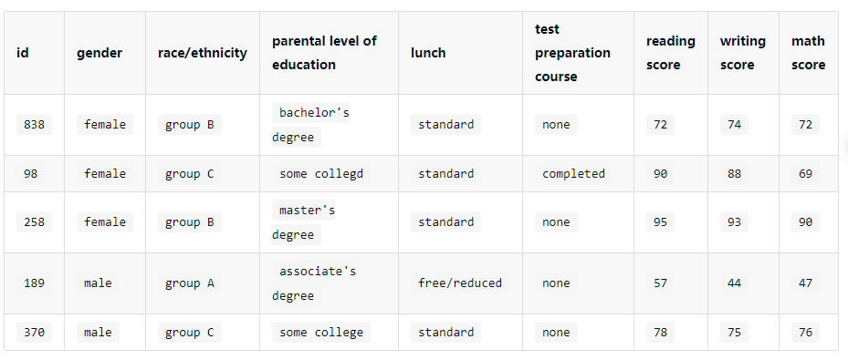
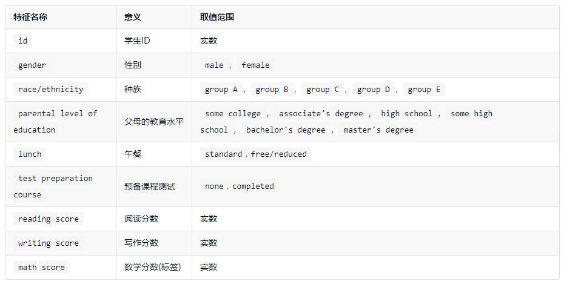
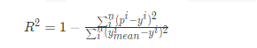
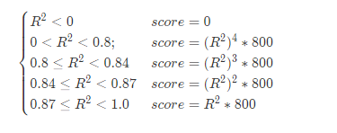
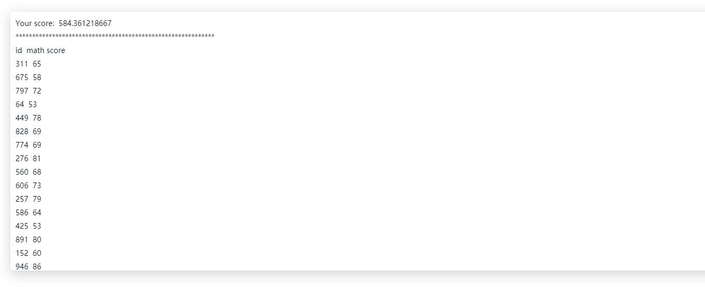

---
    第二届绿色计算的预赛最后一题 机器学习
    我使用的依旧是经典的线性回归 比赛当天因为疏忽 最后模型没跑出来
    今天试了下 跑出来了 因为一个变量输入的形式问题 导致之前一直出错
    想想还是挺可惜的
---

# 题目如下：  

## 挑战任务  
现在有一些由学生的基础信息和两门考试成绩所组成的数据，需要你根据这些数据来预测学生的数学成绩。  

## 数据说明  
为了完成本次挑战，你需要处理两种类型的数据，第一：训练集数据，第二：测试集数据，最后根据提供的两种数据生成预测结果文件，关于这三种数据文件的说明如下：  

## 训练集数据文件  
本关涉及到的训练集数据train.csv的部分数据如下：  
  
各个特征描述如下：  
  
## 测试集数据文件  
本关涉及到的测试集数据test.csv与train.csv的格式完全相同，但其math score未给出，为预测变量。  

## 预测结果文件  
你需要根据上述训练集文件与测试集文件预测学生的数学分数。  

根据训练集和测试集生成的预测结果数据需要保存在test_prediction.csv文件中，并且需要存放在./output/目录下，编码采用无 BOM 的 UTF-8，每行记录表示对某个学生的数学分出的预测。  

提交文件格式参考如下：  

    id, math score
    311, 15.77
    675, 92.689
    797, 29.12
    64, 37.777
    ……

### 注意:大小写敏感。  

## 评估指标  
本关的预测结果评估指标为:R² score，该值越接近于1表示预测越精准。R² score的计算公式如下：  
  
其中pp为某个样本的预测结果，yy为某个样本的真实标签，ymean 表示所有测试样本标签值的均值。  

本关会根据你的R² score的值来计算你的总得分，总得分(score)的计算公式如下：  
  

## 编程要求  
请补全右侧编辑器中的代码，实现对学生数学成绩的预测，并将预测结果生成在./output/目录下，命名为test_prediction.csv。  

参考思路：  

* 读取./input/train.csv和 ./input/test.csv文件；  
* 数据探索；  
* 数据预处理；  
* 特征工程；  
* 构建模型；  
* 调参；  
* 生成预测结果文件；  
* 提交评测；  
* 持续优化以提高 R² score 指标。  
你可以通过如下链接下载本关涉及到的数据文件：  

https://forge.educoder.net/attachments/download/377881/input.zip  

注意：本环境不提供机器学习框架，需要自己实现相关算法。    
***
代码测试结果：    
  