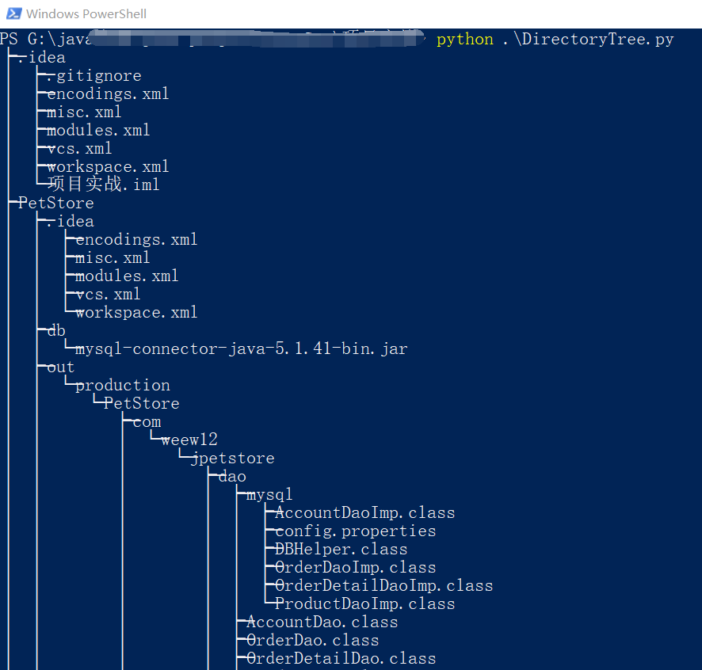
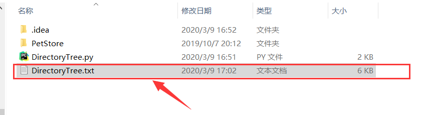
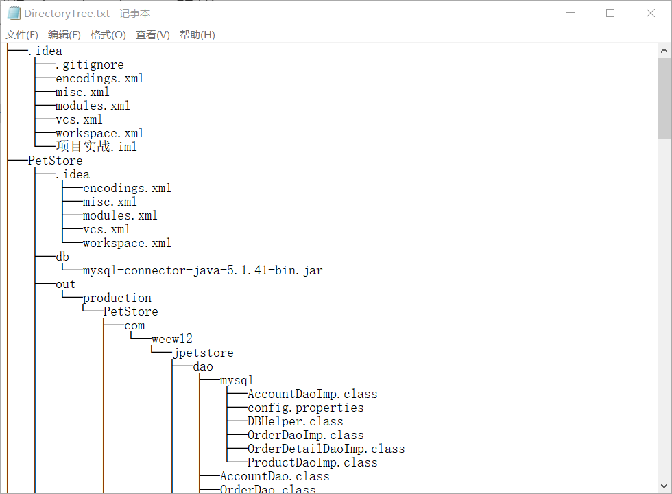

# 目录树生成

---

### 最近有一个生成项目的目录树的需求，虽然 window 的 cmd 提供了这个命令，但是自己试着实现了一下，可以更具功能自行调整

---

### 附上 windows 命令

    tree /F

---

### 程序使用

    打开cmd或者powerShell
    输入python ./DirectoryTree.py
    程序会打印生成的目录树的结构
    生成一个输出文件DirectoryTree.txt

---

### 结果展示

#### 执行

#### 生成文件 DirectoryTree.txt

#### DirectoryTree.txt 内容

---

### TODO

1. [x] 目录树过滤选定后缀文件
2. [x] 优化改善
